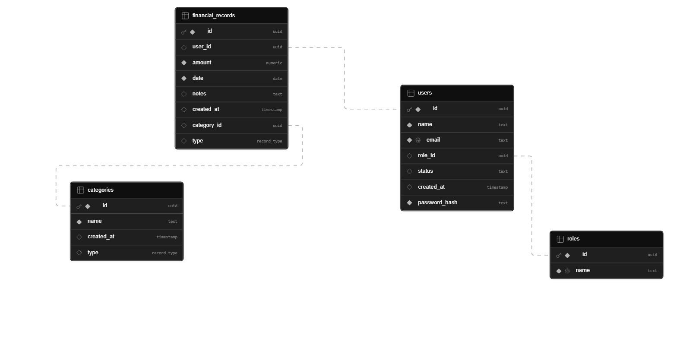
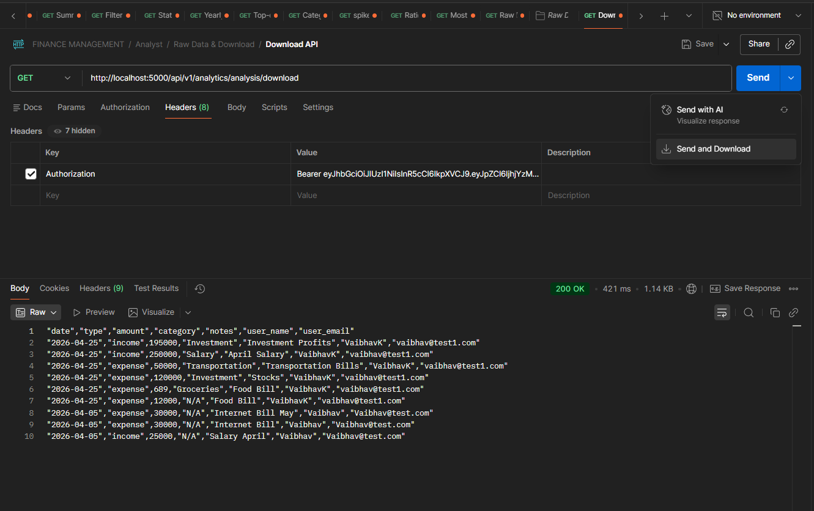
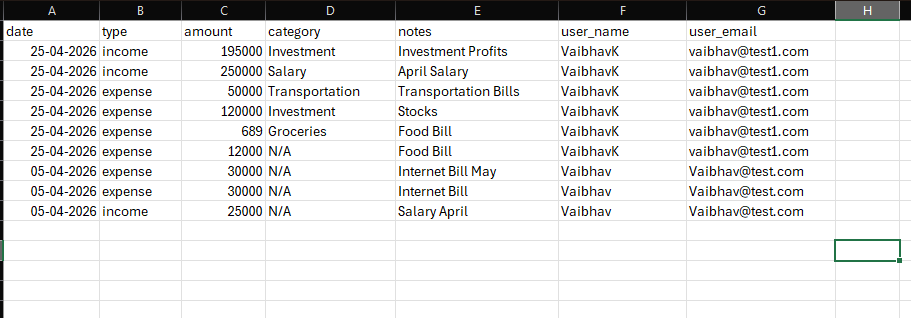
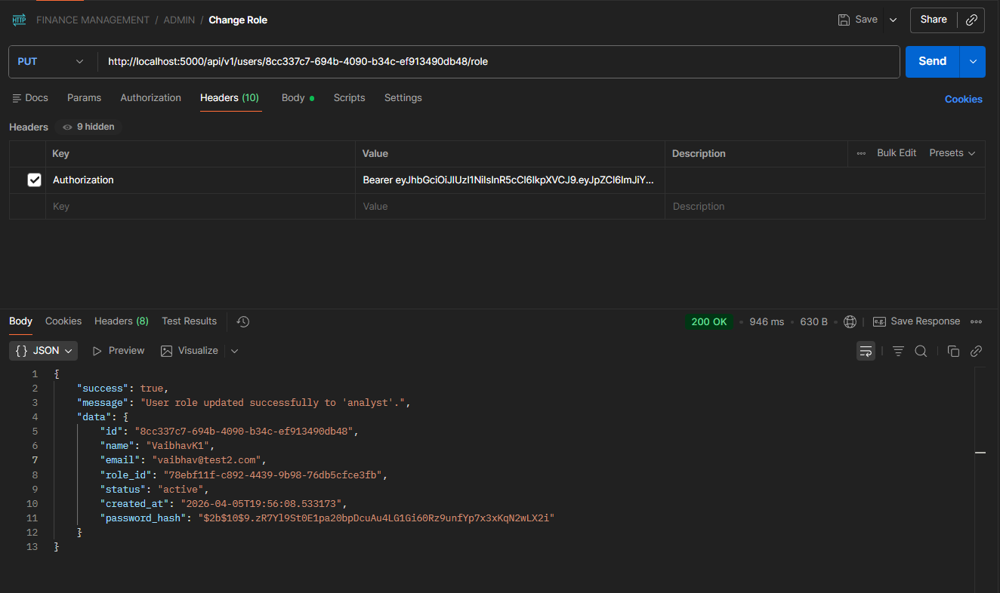

# Finance Management System - Backend

<p align="center">
  
  
  
</p>

Welcome to the backend of the Finance Management System. This robust API is engineered with Node.js, Express, and Supabase to provide a secure, multi-tenant platform for financial record management. It features a sophisticated Role-Based Access Control (RBAC) system and a powerful, database-driven analytics suite designed for performance and scalability.

## Key Features

- **Secure User Authentication:** JWT-based authentication for user registration and login.
- **Role-Based Access Control (RBAC):** Granular permissions for `Viewer`, `Analyst`, and `Admin` roles, ensuring users can only access the data and operations appropriate for them.
- **Financial Record Management:** Admins can perform full CRUD operations on financial records.
- **Global Category System:** A centralized list of categories managed by Admins to ensure data consistency across the application.
- **Advanced Analytics Suite:** A comprehensive set of endpoints for analysts to derive deep insights, powered by performant database functions.
- **Paginated Data API:** Efficiently handles large datasets with a paginated raw data endpoint for analysts.
- **CSV Data Export:** Allows analysts to download filtered datasets for offline analysis.
- **Performant Database Logic:** Leverages PostgreSQL functions via Supabase RPC for complex calculations, ensuring high performance by keeping heavy computation on the database server.

## Tech Stack

- **Backend:** Node.js, Express.js
- **Database:** Supabase (PostgreSQL)
- **Authentication:** JSON Web Tokens (JWT)
- **Key Libraries:** `@supabase/supabase-js`, `bcrypt`, `jsonwebtoken`, `cors`, `morgan`, `dotenv`, `json2csv`

---

## Architectural Highlights

The system is designed with a clean, scalable, and maintainable architecture. The following diagram provides a high-level overview of how the different components interact.

- The system is designed with a clean, scalable, and maintainable architecture.


<br/>

- **Database-Centric Logic:** We leverage Supabase and its underlying PostgreSQL engine to handle complex computations. Instead of pulling large datasets into the application for processing, we use **PostgreSQL Functions (RPC)** to perform analytics calculations directly on the database server. This approach is significantly faster and more memory-efficient.

- **Strict Access Control:** Security is paramount. The application uses a combination of Express middleware (`authMiddleware`, `allowRoles`) for route protection and can be extended with Supabase's Row Level Security (RLS) for database-level data isolation.

- **Separation of Concerns:** The code is organized by feature, with a clear distinction between routes (API definitions), controllers (request/response handling), and services (business logic), making the codebase clean, maintainable, and easy to extend.

---

## Setup and Installation

Follow these steps to get the project up and running on your local machine.

### 1. Prerequisites

- Node.js (v18 or higher recommended)
- npm or yarn
- A Supabase account and a new project created.

### 2. Clone the Repository

```bash
git clone <your-repository-url>
cd <repository-folder>
```

### 3. Install Dependencies

```bash
npm install
```

### 4. Environment Variables

Create a `.env` file in the root of the project. This file will store your secret keys and configuration variables.

```env
# Server Port
PORT=5000

# JWT Secret for signing tokens (choose a long, random string)
JWT_SECRET=your_strong_jwt_secret_key

# Supabase Project Credentials
SUPABASE_URL=https://your-project-id.supabase.co
SUPABASE_SERVICE_ROLE_KEY=your_supabase_service_role_key
```

**How to get Supabase keys:**

- Navigate to your Supabase project dashboard.
- Go to **Settings** > **API**.
- You will find your `Project URL` (`SUPABASE_URL`) and the `service_role` key (`SUPABASE_SERVICE_ROLE_KEY`) under the "Project API keys" section.

> **Important:** The `SUPABASE_SERVICE_ROLE_KEY` has administrative privileges and can bypass any Row Level Security (RLS) policies. **It must be kept confidential and should never be exposed on the client-side.** Our backend uses this key to perform privileged operations.

---

## Database Initialization

Before running the application, you need to set up your Supabase database schema and functions. Go to the **SQL Editor** in your Supabase dashboard and run the following queries.

### 1. Seed Roles Table

These are the three fundamental roles used for access control in the application.

```sql
-- Insert the three required user roles
INSERT INTO roles (name)
VALUES
  ('viewer'),
  ('analyst'),
  ('admin')
ON CONFLICT (name) DO NOTHING;
```

### 2. Seed Global Categories Table

This populates the `categories` table with a standard set of global categories for consistent data entry.

```sql
-- Insert a standard set of global categories
INSERT INTO categories (name, type)
VALUES
  ('Salary', 'income'),
  ('Freelance', 'income'),
  ('Investment', 'income'),
  ('Other', 'income'),
  ('Rent', 'expense'),
  ('Groceries', 'expense'),
  ('Utilities', 'expense'),
  ('Transportation', 'expense'),
  ('Software', 'expense'),
  ('Office Supplies', 'expense'),
  ('Other', 'expense');
```

### 3. Create Analytics Database Functions

These functions are crucial for the performance of the analytics endpoints. They perform calculations directly within the database, which is much faster than processing data in the application.

```sql
-- This function powers the main dashboard for all users.
CREATE OR REPLACE FUNCTION get_user_dashboard(p_user_id uuid, p_role text)
RETURNS TABLE (
    metric_name text,
    metric_value jsonb
)
LANGUAGE plpgsql
AS $$
BEGIN
    -- For viewers, show only their own data
    IF p_role = 'viewer' THEN
        RETURN QUERY
        SELECT 'personal_summary' as metric_name, jsonb_build_object(
            'total_income', COALESCE(SUM(amount) FILTER (WHERE type = 'income'), 0),
            'total_expenses', COALESCE(SUM(amount) FILTER (WHERE type = 'expense'), 0)
        ) as metric_value
        FROM financial_records
        WHERE user_id = p_user_id;

    -- For admins and analysts, show system-wide data
    ELSE
        RETURN QUERY
        SELECT 'system_summary' as metric_name, jsonb_build_object(
            'total_income', COALESCE(SUM(amount) FILTER (WHERE type = 'income'), 0),
            'total_expenses', COALESCE(SUM(amount) FILTER (WHERE type = 'expense'), 0),
            'total_records', COUNT(*)
        ) as metric_value
        FROM financial_records;
    END IF;
END;
$$;
```

> **Note on Other Analytics Functions:**
> The `analyticsService.js` file calls several other RPC functions (e.g., `get_yearly_analysis`, `get_top_expenses`, `get_spikes`). These functions are not defined here but must be created in your Supabase SQL Editor for the corresponding analyst endpoints to work. They follow a similar pattern of performing a SQL query and returning the result.

---

## Database Schema

The following diagram illustrates the relationships between the core tables in the Supabase database. It provides a clear overview of how `users`, `roles`, `categories`, and `financial_records` are interconnected.



---

## Running the Application

Once the setup is complete, you can start the development server.

```bash
npm start
```

The server will start on the port specified in your `.env` file (default is 5000) and will be accessible at `http://localhost:5000`.

---

## API Reference

The following diagram illustrates the general flow of a request through the API, from the client to the database and back.

!API Request Flow

<br/>

### API Conventions

- **Authentication:** All protected endpoints require a `Bearer Token` in the `Authorization` header, obtained from the `/users/login` endpoint.

- **Successful Responses:**
  - `200 OK`: For successful `GET`, `PUT`, `DELETE` requests.
  - `201 Created`: For successful `POST` requests that create a new resource.
  - The response body will consistently follow this structure:
    ```json
    {
      "success": true,
      "message": "Descriptive success message.",
      "data": { ... } // or [ ... ]
    }
    ```

- **Error Responses:**
  - `400 Bad Request`: The request body is missing required fields or contains invalid data.
  - `401 Unauthorized`: The request is missing a valid JWT token.
  - `403 Forbidden`: The authenticated user does not have the required role to access this endpoint.
  - `404 Not Found`: The requested resource (e.g., a user, record, or category) does not exist.
  - `409 Conflict`: The request could not be completed due to a conflict (e.g., trying to register an email that already exists).
  - `500 Internal Server Error`: An unexpected error occurred on the server.
  - The error response body will follow this structure:
    ```json
    {
      "success": false,
      "message": "Descriptive error message."
    }
    ```

---

## Roles & Permissions

The application's security model is built around a clear Role-Based Access Control (RBAC) system. The flow of an authenticated request through the permission middleware is illustrated below.

!Role-Based Access Control Flow

<br/>

The application employs a strict Role-Based Access Control (RBAC) model to ensure data security and integrity. There are three distinct roles, each with a specific set of permissions.

---

### 1. The Viewer

**Persona:** A standard user who needs to track their own finances but should not have access to system-wide data or administrative functions.

**Real-life Example:** A regular employee in a company using the platform for personal budget tracking.

**Permissions:**

- ✅ **Can** register and log in to their own account.
- ✅ **Can** view their own high-level dashboard (`/analytics/dashboard`).
- ✅ **Can** view the list of global categories (`/categories`).
- ✅ **Can** view a list of financial records they have created (`/records`).
- ❌ **Cannot** create, update, or delete financial records. This is an admin function.
- ❌ **Cannot** manage global categories.
- ❌ **Cannot** access the advanced analytics suite meant for analysts.
- ❌ **Cannot** change user roles.

---

### 2. The Analyst

**Persona:** A data-focused user who needs read-only access to the entire system's financial data to identify trends, generate reports, and provide insights. They are not involved in data entry.

**Real-life Example:** A financial analyst or a data scientist in a company's finance department.

**Permissions:**

- ✅ **Can** do everything a `Viewer` can.
- ✅ **Can** access the **full suite of advanced analytics endpoints** (`/analytics/analysis/...`). This is their primary function.
- ✅ **Can** view and filter **all** financial records from **all users** via the raw data API (`/analytics/analysis/raw`).
- ✅ **Can** download the complete system-wide dataset as a CSV file (`/analytics/analysis/download`).

Below is an example of using the CSV download API and the resulting Excel sheet.




- ❌ **Cannot** create, update, or delete any financial records. Their role is strictly read-only to maintain data integrity.
- ❌ **Cannot** manage users or categories.

---

### 3. The Admin

**Persona:** A super-user with full control over the system. They are responsible for managing the data, users, and configuration of the application.

**Real-life Example:** A system administrator, a finance manager, or a department head with full administrative rights.

**Permissions:**

- ✅ **Can** do everything a `Viewer` and `Analyst` can.
- ✅ **Can** create, update, and delete **any** financial record (`/records`).
- ✅ **Can** manage the global list of categories (create, update, delete) for the entire application (`/categories`).
- ✅ **Can** manage users by changing their roles (`/users/:id/role`).

Here is an example of an Admin changing a user's role from `viewer` to `analyst`.



---

## API Endpoint Summary

| Endpoint                          | Viewer | Analyst | Admin |
| :-------------------------------- | :----: | :-----: | :---: |
| **Authentication**                |        |         |       |
| `/users/register`, `/users/login` |   ✅   |   ✅    |  ✅   |
| **User Management**               |        |         |       |
| `/users/:id/role`                 |   ❌   |   ❌    |  ✅   |
| **Record Management**             |        |         |       |
| `GET /records` (own records)      |   ✅   |   ✅    |  ✅   |
| `POST /records`                   |   ❌   |   ❌    |  ✅   |
| `PUT /records/:id`                |   ❌   |   ❌    |  ✅   |
| `DELETE /records/:id`             |   ❌   |   ❌    |  ✅   |
| **Category Management**           |        |         |       |
| `GET /categories`                 |   ✅   |   ✅    |  ✅   |
| `POST / PUT / DELETE /categories` |   ❌   |   ❌    |  ✅   |
| **Analytics**                     |        |         |       |
| `/analytics/dashboard`            |   ✅   |   ✅    |  ✅   |
| `/analytics/analysis/*`           |   ❌   |   ✅    |  ✅   |

---

## Project Structure

The project follows a standard feature-based structure for clarity and maintainability.

```
/src
├── config/
│   └── supabase.js         # Supabase client initialization
├── controllers/
│   └── ...                 # Request/response handlers for each feature
├── middlewares/
│   ├── authMiddleware.js   # JWT validation
│   └── roleMiddleware.js   # Role-based access control
├── routes/
│   └── ...                 # API route definitions for each feature
├── services/
│   └── ...                 # Business logic and database interactions
├── utils/
│   └── authUtils.js        # Password hashing, token generation
├── app.js                  # Express app configuration and middleware setup
└── server.js               # Server entry point
```

````

### 5. Start the Server

```bash
npm start
````

The server will start on the port specified in your `.env` file (default is 5000).

---

## Roles & Permissions

The application employs a strict Role-Based Access Control (RBAC) model to ensure data security and integrity. There are three distinct roles, each with a specific set of permissions.

---

### 1. The Viewer

**Persona:** A standard user who needs to track their own finances but should not have access to system-wide data or administrative functions.

**Real-life Example:** A regular employee in a company using the platform for personal budget tracking.

**Permissions:**

- ✅ **Can** register and log in to their own account.
- ✅ **Can** view their own high-level dashboard (`/analytics/dashboard`).
- ✅ **Can** view the list of global categories (`/categories`).
- ✅ **Can** view a list of financial records they have created (`/records`).
- ❌ **Cannot** create, update, or delete financial records. This is an admin function.
- ❌ **Cannot** manage global categories.
- ❌ **Cannot** access the advanced analytics suite meant for analysts.
- ❌ **Cannot** change user roles.

---

### 2. The Analyst

**Persona:** A data-focused user who needs read-only access to the entire system's financial data to identify trends, generate reports, and provide insights. They are not involved in data entry.

**Real-life Example:** A financial analyst or a data scientist in a company's finance department.

**Permissions:**

- ✅ **Can** do everything a `Viewer` can.
- ✅ **Can** access the **full suite of advanced analytics endpoints** (`/analytics/analysis/...`). This is their primary function.
- ✅ **Can** view and filter **all** financial records from **all users** via the raw data API (`/analytics/analysis/raw`).
- ✅ **Can** download the complete system-wide dataset as a CSV file (`/analytics/analysis/download`).
- ❌ **Cannot** create, update, or delete any financial records. Their role is strictly read-only to maintain data integrity.
- ❌ **Cannot** manage users or categories.

---

### 3. The Admin

**Persona:** A super-user with full control over the system. They are responsible for managing the data, users, and configuration of the application.

**Real-life Example:** A system administrator, a finance manager, or a department head with full administrative rights.

**Permissions:**

- ✅ **Can** do everything a `Viewer` and `Analyst` can.
- ✅ **Can** create, update, and delete **any** financial record (`/records`).
- ✅ **Can** manage the global list of categories (create, update, delete) for the entire application (`/categories`).
- ✅ **Can** manage users by changing their roles (`/users/:id/role`).

---

## API Endpoint Summary

| Endpoint                          | Viewer | Analyst | Admin |
| :-------------------------------- | :----: | :-----: | :---: |
| **Authentication**                |        |         |       |
| `/users/register`, `/users/login` |   ✅   |   ✅    |  ✅   |
| **User Management**               |        |         |       |
| `/users/:id/role`                 |   ❌   |   ❌    |  ✅   |
| **Record Management**             |        |         |       |
| `GET /records` (own records)      |   ✅   |   ✅    |  ✅   |
| `POST /records`                   |   ❌   |   ❌    |  ✅   |
| `PUT /records/:id`                |   ❌   |   ❌    |  ✅   |
| `DELETE /records/:id`             |   ❌   |   ❌    |  ✅   |
| **Category Management**           |        |         |       |
| `GET /categories`                 |   ✅   |   ✅    |  ✅   |
| `POST / PUT / DELETE /categories` |   ❌   |   ❌    |  ✅   |
| **Analytics**                     |        |         |       |
| `/analytics/dashboard`            |   ✅   |   ✅    |  ✅   |
| `/analytics/analysis/*`           |   ❌   |   ✅    |  ✅   |

---

## Project Structure

The project follows a standard feature-based structure for clarity and maintainability.

```
/src
├── config/
│   └── supabase.js         # Supabase client initialization
├── controllers/
│   └── ...                 # Request/response handlers for each feature
├── middlewares/
│   ├── authMiddleware.js   # JWT validation
│   └── roleMiddleware.js   # Role-based access control
├── routes/
│   └── ...                 # API route definitions for each feature
├── services/
│   └── ...                 # Business logic and database interactions
├── utils/
│   └── authUtils.js        # Password hashing, token generation
├── app.js                  # Express app configuration and middleware setup
└── server.js               # Server entry point
```
